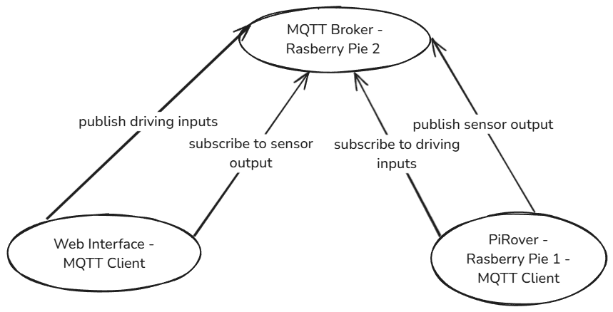

# Project Proposal - PiRover

In this project, we aim to design and develop 'PiRover', a remotely controlled vehicle containing various sensors leveraging Raspberry Pi technology. We want to create something interactive where we can see our results in real-time since that is a lot more interesting, motivating and fun.

##### The vehicle

Although the technical basis of our project will be a Raspberry Pie, we will also need a vehicle to put it on top of. Since the hardware list does not contain such a vehicle and we do not expect the institute to provide one, we decided to order one as soon as our proposal gets approved. The one we have in mind is the [Freenove Three-Wheeled Smart Car Kit for Raspberry Pi](https://www.amazon.de/-/en/Freenove-Three-Wheeled-Raspberry-Detailed-Ultrasonic/dp/B06W54XC9V/?_encoding=UTF8&pd_rd_w=NbBPv&content-id=amzn1.sym.16038c01-cfea-4f09-a119-c9f8c051c46c%3Aamzn1.symc.fc11ad14-99c1-406b-aa77-051d0ba1aade&pf_rd_p=16038c01-cfea-4f09-a119-c9f8c051c46c&pf_rd_r=C9APQH9AX00SJGGV74ZT&pd_rd_wg=PN9IM&pd_rd_r=f792269b-8805-4245-86c0-df937cf69d77&ref_=pd_hp_d_atf_ci_mcx_mr_ca_hp_atf_d). It is designed to work well with a Raspberry Pie. This vehicle will still have to be assembled by us though. 

##### Actuators

The vehicle will be controlled via motors. We will also place brake-light on the rear end of the vehicle to indicate when it is slowing down.

##### Sensors

For sensors, we plan for our PiRover to have a few:
- A camera. We can then either use this camera to more easily control our vehicle remotely or we can collect the camera footage as kind of a surveillance feature. 
- An ultrasonic sensor for measuring distance. Its main purpose would be to detect when the vehicle is approaching another object and possibly activate some kind of emergency brake system to avoid that it crashes and gets damaged.
- An accelerometer. We can use it so display the current speed to the pilot, thought we could also use it to make sure the PiRover holds a specific speed when the pilot wants that exact speed, similiar to a cruise control. 
- Brightness sensor.

##### Web Interface

The PiRover is supposed to be controlled via a Web-Interface. We will allow inputs for acceleration and steering, which the PiRover should behave according to in real-time. In addition, the pilot should get feedback from the different sensors. The accelerometer tells him how fast he is going, the ultrasonic tells him how far he is away from an object and the camera allows him to see what is in front of him. Additionally, we also plan that the Web-Interface has some kind of statistics page, where date like camera footage, brightness, speed and distance are aggregated and presented in interesting ways. 

##### Sensor Data Processing with UI Interface for Data Exploration

As part of the project, we implement a Grafana-based user interface running on a Raspberry Pi, which connects to a local PostgreSQL database for data visualization. The data is continuously sent from the PiRover, which publishes sensor and actuator information — including motor status, ultrasonic distance readings, accelerometer data, and binary light sensor states (on/off). Additionally, the rover broadcasts a high-level status tag indicating its current mode (like idle, exploring, or obstacle detected). This data is structured into dedicated tables for each sensor and actuator, within the PostgreSQL database. With Grafana, users can interactively explore this historical data and identify behavioral patterns over time—for example, analyzing the correlation between ultrasonic sensor readings and the rover’s obstacle detection mode to assess its responsiveness and decision-making logic. Also a total distance traveled by the rover can be calculated and displayed in the UI. This setup not only enhances the user experience but also provides valuable insights into the rover's performance and behavior.

### System architecture

We are planning that our Web-Interface communicates with the Raspberry Pie on the PiRover via MQTT. We will use a second Rasberry Pie as our MQTT Broker. The architecture can be seen in the image below:

Since all the Raspberry Pie models listed in the Hardware List have Wifi capabilities, we plan to use Wifi on the MQTT Broker and PiRover to communicate. We will code the Web Interface in Svelte, since it is not overly complex. We could host the Web Interface on Netlify, for instance.

### Required Materials

### Fulfillment of Project Requirements

### Timeline

