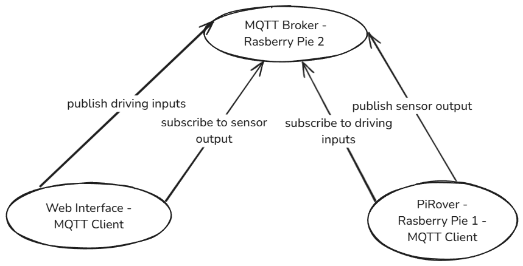

# Project Proposal - PiRover

Group 5

kxxxxxxxx, Olivotto Philipp \
kxxxxxxxx, Pichler Alexander \
k12308997, Schoenberger Fabian \
kxxxxxxxx, Siala Alexander

## Description

In this project, we aim to design and develop 'PiRover', a remote-controlled vehicle containing various sensors and actuators leveraging Raspberry Pi technology.
The goal is to control the vehicle in real-time, no matter the location, as long as it is connected to the internet.

### The vehicle

Although the technical basis of our project will be a Raspberry Pi, we will also need a vehicle to put it on top of. 
Since the hardware list does not contain such a vehicle, and we do not expect the institute to provide one, we will to order one as soon as our proposal gets approved. 
The specific model we have in mind is listed down below in our hardware list. 
The vehicle will have to be assembled by us with the help of a manual. 

### Actuators

The vehicle will have the following actuators:
- Two motors to drive the vehicle.
- A motor to turn the camera.
- Rear light(s) to indicate slowing down or driving backwards.
- Front light(s) to illuminate the path when it is dark.

### Sensors

For sensors, we plan for our PiRover to have a few:
- A camera to be able to see a live feed of what is in front of the vehicle.
- An ultrasonic sensor for measuring distances which will assist the driver when driving backwards. 
The application will display a warning if the vehicle is about to bump into anything.
- An accelerometer which can be used to display the current speed of the vehicle to the driver.
Its data can also be used to activate the rear light(s) when required.
- A brightness sensor to be able to automatically turn on the front light(s) of the vehicle when it gets too dark.

### Web Interface

The PiRover will be remotely controlled via a Web-Interface. 
The interface will show a live feed of the camera and allows for the control of the vehicles acceleration and steering. 
Furthermore, the front lights can be overridden to be permanently on or off.
In addition, the driver will be given important information like speed, acceleration and information whether something is behind the vehicle.

The vehicle will be controlled via standard WASD + arrow keys controls and will optionally support a Gamepad.

It will be developed using Svelte.

## System Architecture

We are planning to have two devices communicating with each other.
- One will be responsible for reading sensor data and controlling actuators.
Additionally, it will publish relevant sensor data to the broker and subscribe to driving inputs.
- Another will be the MQTT broker and web server for the Web Interface.

Technically, a third point of contact is involved: the browser from which the application is opened.

 //TODO fix image

To ensure full mobility while still being connected to the internet, we are going to connect the vehicles Raspberry Pi to Wi-Fi.

## Hardware List

[Freenove Three-Wheeled Smart Car Kit for Raspberry Pi](https://www.amazon.de/-/en/Freenove-Three-Wheeled-Raspberry-Detailed-Ultrasonic/dp/B06W54XC9V/?_encoding=UTF8&pd_rd_w=NbBPv&content-id=amzn1.sym.16038c01-cfea-4f09-a119-c9f8c051c46c%3Aamzn1.symc.fc11ad14-99c1-406b-aa77-051d0ba1aade&pf_rd_p=16038c01-cfea-4f09-a119-c9f8c051c46c&pf_rd_r=C9APQH9AX00SJGGV74ZT&pd_rd_wg=PN9IM&pd_rd_r=f792269b-8805-4245-86c0-df937cf69d77&ref_=pd_hp_d_atf_ci_mcx_mr_ca_hp_atf_d)

## Fulfillment of Project Requirements

## Timeline

