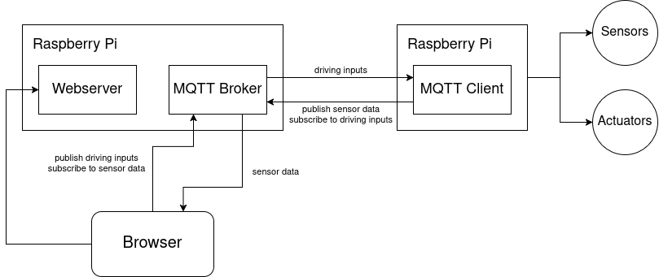

# Project Proposal - PiRover

Group 5

kxxxxxxxx, Abudllah Arij \
k12223453, Olivotto Philipp \
kxxxxxxxx, Pichler Alexander \
k12308997, Schoenberger Fabian \
kxxxxxxxx, Siala Alexander (Leader)

## Description

In this project, we aim to design and develop 'PiRover', a remote-controlled vehicle containing various sensors and actuators leveraging Raspberry Pi technology.
The goal is to control the vehicle in real-time, no matter the location, as long as it is connected to the internet.

### The vehicle

Although the technical basis of our project will be a Raspberry Pi, we will also need a vehicle to put it on top of. 
Since the hardware list does not contain such a vehicle, and we do not expect the institute to provide one, we will to order one as soon as our proposal gets approved. 
The specific model we have in mind is listed down below in our hardware list. 
The vehicle will have to be assembled by us with the help of a manual. 

### Actuators

The vehicle will have the following actuators:
- Two motors to drive the vehicle.
- A motor to turn the camera.
- Rear light(s) to indicate slowing down or driving backwards.
- Front light(s) to illuminate the path when it is dark.

### Sensors

For sensors, we plan for our PiRover to have a few:
- A camera to be able to see a live feed of what is in front of the vehicle.
- An ultrasonic sensor for measuring distances which will assist the driver when driving backwards. 
The application will display a warning if the vehicle is about to bump into anything.
- An accelerometer which can be used to display the current speed of the vehicle to the driver.
Its data can also be used to activate the rear light(s) when required.
- A brightness sensor to be able to automatically turn on the front light(s) of the vehicle when it gets too dark.

### Web Interface

The PiRover will be remotely controlled via a Web-Interface. 
The interface will show a live feed of the camera and allows for the control of the vehicle's acceleration and steering. 
Furthermore, the front lights can be overridden to be permanently on or off.
In addition, the driver will be given important information like speed, acceleration and information whether something is behind the vehicle.

The vehicle will be controlled via standard WASD + arrow keys controls and will optionally support a Gamepad.

It will be developed using Svelte.

### Data-Processing

As part of the project, we implement a Grafana-based user interface running on a Raspberry Pi, which connects to a local PostgreSQL database for data visualization.

The PiRover continuously sends data from sensors and actuators - including motor status, ultrasonic distance readings, accelerometer data, and binary light sensor states (on/off). 
Additionally, the rover broadcasts a high-level status tag indicating its current mode (like idle, exploring, or obstacle detected).

The data is structured into dedicated tables for each sensor and actuator, within the PostgreSQL database.
With Grafana, users can explore historical data and identify behavioral patterns over time. For example, analyzing the correlation between ultrasonic sensor readings and the rover’s obstacle detection mode to assess the decision-making logic.
This setup not only enhances the user experience but also provides valuable insights into the rover's performance and behavior.

## System Architecture

We are planning to have two devices communicating with each other.
- One will be responsible for reading sensor data and controlling actuators.
Additionally, it will publish relevant sensor data to the broker and subscribe to driving inputs.
- Another will be the MQTT broker and web server for the Web Interface.

Technically, a third point of contact is involved: the browser from which the application is opened.

To ensure full mobility while still being connected to the internet, we are going to connect the vehicle's Raspberry Pi to Wi-Fi.

## Hardware List

TODO 

| part              | further information                                                                                                                               | requested     |
|-------------------|---------------------------------------------------------------------------------------------------------------------------------------------------|---------------|
| 2x Raspberry Pi   |                                                                                                                                                   | yes           |
| vehicle           | [Freenove Three-Wheeled Smart Car Kit for Raspberry Pi](https://amzn.eu/d/hJ5U5ri)   includes all 3 motors, a camera and an ultrasonic sensor | no            |
| battery pack      |                                                                                                                                                   | yes           |
| lights            | at least 1x white and 1x red                                                                                                                      | yes           |
| accelerometer     |                                                                                                                                                   | if possible * |
| brightness sensor |                                                                                                                                                   | if available  |

\* due to an addon that comes with the vehicle, the sense-hat addon will (probably?) not fit

## Fulfillment of Project Requirements

Our project requires a lot of communication and coordination with sensors/actuators and in between different systems.
These systems need to work in real-time without sacrificing quality requiring us to design a robust architecture.

The PiRover needs to: read sensor data, manage current actuator state and control actuators based on both sensor data and driving inputs received over MQTT. \
The Web Interface needs to: efficiently display received sensor and actuator data and implement intuitive controls (keyboard and gamepad)

Furthermore, we will implement Grafana which will let us analyze and monitor sensor and actuator data.

All 4 sensors and 5 actuators fulfill a vital role in the overall driving experience. \
Although our project only uses 4 sensors for 5 people, we feel the complexity of the project should outweigh alleviate this requirement.

## Timeline

TODO: add due dates to each sub-task

PiRover
1. setup
2. assemble vehicle
3. test sensors and actuators
4. collect and publish sensor and actuator data
5. control lights based on data
6. handle driving input

RemotePi (our second Raspberry Pi)
1. setup
2. install and setup MQTT broker
3. deploy Web Interface
4. setup Grafana

Web Interface
1. display camera feed
2. display current data (acceleration, lighting states, front lighting mode (automatic, manual))
3. control lights manually
4. keyboard driving controls
5. gamepad driving controls
6. display data about objects behind PiRover

Grafana
1. TODO@Philipp
